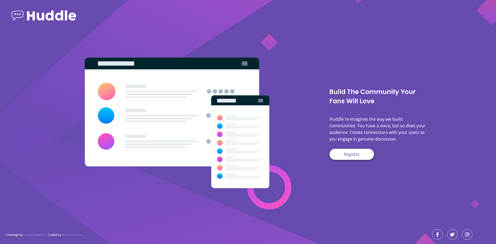

# Frontend Mentor - Huddle landing page with single introductory section solution

This is a solution to the [Huddle landing page with single introductory section challenge on Frontend Mentor](https://www.frontendmentor.io/challenges/huddle-landing-page-with-a-single-introductory-section-B_2Wvxgi0). 

## Overview

### Screenshot

The project is a simple landing page with a introdctory section and a register button, just whit HTML5 and CSS3

### Links

- Solution URL: [Huddle landing page]([https://huddle-landing-page-wall.netlify.app])

## My process

### Built with

- HTML5
- CSS
- Flexbox
- CSS Grid

### What I learned

In this project I ended up learning how to better use GRID and FLEX together to make pages more attractive, in addition to that I used resources like fontawesome and @media for multiple screen sizes.

## Author

- Github - [Wallison Viana](https://github.com/7Wall)
- Frontend Mentor - [@7Wall](https://www.frontendmentor.io/profile/7Wall)
